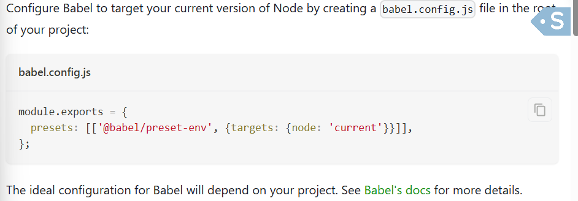

# Developer Testing

Different type of testing that a developer can do
1. Manual Testing
2. He can write code to test the application

1. Manual Testing
   -> supppose I have developed a contact page, so i will test it, its running or not, its called manual testing
   Ex- If you implement the filter functinality the  you test the filter functionality on UI.

so If I am developing a small featue in the app 
will I will be going to test the whole app?

--> Even if you write a single line of code that can introduce a bug any where

suppose we have 100 of components and all this components are interacting with each other
suppose if we make a few changes in the filter component, it will introduce bug in any where of your app.

Even a single line of code can introduce a new bug in the whole app.

In large company there testing is must

2. wriing the test case for testing the application.

# Type of testing that a developer can do
1. Unit Testing
2. Integration Testing
3. End to End Testing - e2e testing

1. Unit Testing
  - You test your rect app in isolation.
  - Testing 1 unit or (small component) in isolation of your react application called unit testing

2. Integration Testing
  - when we have a lots of component and this component communicates with each other this is called integration testing.
  There are multiple component and they are communicating to each other, and we develop a flow of action in our react application, that we will test.
  there is event getting triggered, input is getting changed.

  we will write the code to do this type of testing

3. End to End Testing
 - testing the app as soon as user lands on the website to user leaves from the website, we test all the flow.
 Ex- user login to the page, entering the login/password, going inside the resurant, adding food to the cart etc

End of End tesing requires different type of tools 
like syprus, selinum, propertier

As a developer we are majorly considering first 2 testing
Testing is a part of writing code, in big company whenever you write some code you also write test case for those code.
so make this as habit.

Library used for writing test cases
1. React Testing Library

DOM testig library is the base of all testing library. all other library is built on top of it.

if you crate app using CRA(create react app) then it already integrated with the tesing library.

but in our case we have written every things from scrach using parcel.
with parcel so we need to integrate and setup the react testing librabry

react testing library using something known as JEST
behind the schene. JEST is different testing library and react uses it behind the schene.

JEST in turn using babel

# Installation
as we need this for development only so we install it as dev dependency
1. npm install -D @testing-library/react - install react testing librabry
2. npm install -D jest - install JEST

now when you go to the get started on jest application you will see it uses babel too
so we need to install this dependency too

3. npm install --save-dev babel-jest @babel/core @babel/preset-env
 - install babel dependency, is required when we use babel.

now we need to configure the babel as we are using babel with parcel

4. configure pacel config file to disbale default babel transpilation.
# Link - https://jestjs.io/docs/getting-started
create a babel.config.js 

As Parcel uses babel behind the schene
as babel is transpiler
now we are trying to configure babel according to our need, it will try to overide the configuration of parcel that it has set for us.

Now we need to change the parcel behaviour to accomdate jest with babel
so for that go to the parcel documentation
from left side bar select javascript

now from the right side bar select babel- read it.
now once you do the configuration this babel will not conflict

# How to run our test case
in the package.json you will see the test inside the script that has value jest that we have selected while configuring the package.json
so when you run npm run test 
it will run our test cases.

if while running "npm run test" you found this
No tests found, exiting with code 1
that means you have successfully configured the jest, if there was some error then it would have thrown error.

5. create the jest configuration

# run jest
using npx jest --init or npx create-jest@latest

It will prompt some questions
# Would you like the typescript for configuration file? No
# Choose the test enviroment that will be used for testing - Jsdom (browser-like)

JSDOM - when you run test cases there is not server or browser is running. its not rnning on browser like chrome etc
so they will need the enviroment(runtime) to run this testcases so there is enviroment named JSDOM.

It is not a brower, but acts like a browser and give you the features of browser and all test cases will going to run on JSDOM.
ex- if we are going to test header component then it would be going to test here in the JSDOM.

# Do you want to jest to add coverage reports - yes
# Which provider should be used to instruct code for coverage? - babel
# Automatically clear mock calls, instances, contexts and result before every test? - yes

Now you will see a configuration file that gets automatic created
jest.config.js

6. install jsdom library
npm install --save-dev jest-environment-jsdom

7. install @babel/preset-react - to run the test cases

8. include @babel/preset-react in babel.config.js

9. install @testing-library/jest-dom
as the method (toBeInDocument) comes from here.
10. Lets start writing test cases
babel is a transpiler that converts your one code to another
babel preset react hels our testing library to convert the jsx code into the html to that
it can read properly.

Lets start testing with some javascript code
create the sum.js and write a function for adding 2 numbers
but how will jest track this js file

Lets create a folder with name __test__
any where in your folder structure. 
now whatever (js/ts) is present inside this folder jest will track that.
and all the files inside that is test file

two times underscore _ _ are known as dunder. we use this dunder for the reserverd word so that no pepole can accidently creates name like this.

or you can create a file with this pattern
Header.test.js
Header.test.ts
Header.spec.js
Header.spec.ts
all the above file will considered as testing file

Now create the test file inside the __tests__

it have a test function that takes 2 argument
1. string - description of the test, what are we testing
2. function - here we write cases to test function that we have created inside the components, so we need to import that

the syntax is like this

test("Sum should caluleate the sum of two numbers", ()=>{
      const result = sum(3, 4);

      //Assertion
      expect(result).toBe(7)
})

in the expect funtion we wil pass the result and toBe takes the argument that we want as result.

To test react component you need to render the react component.
so we use render method provided by react testing library(@testing-library/react) to render the component on JSDOM.

Once the component gets rendered how will you know that the component is rendered?
we will know it by some things that gets displayed on the UI.

so there is one more method provided by react testing library known as screen

screen.getByRole("heading)
to get the heading elemement

then we use expect(heading).toBeInTheDocument();
it means the heading component is inside this document or not.

Note: while running test cases it creates the converage folder but we don't need to push this on github add it to the gitignore.

If you want your test to run in the background even after making changes in the test file, just like we are doing in case of writing react code - HMR
we can achieve this using 

in package.json create new test command
"watch-test":"jest --watch"

To see the coverage report go to the coverage folder and open the index.html using live server
you will see the coverage report of different component. the good coverage report should be above 85%.

